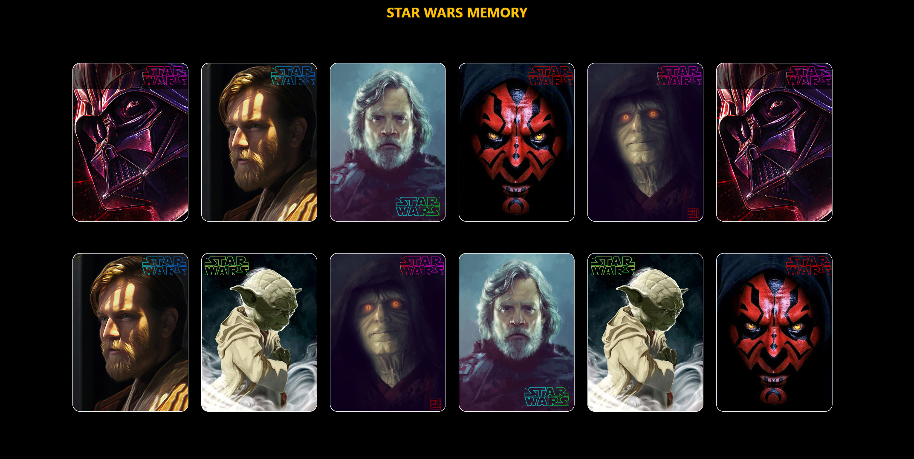
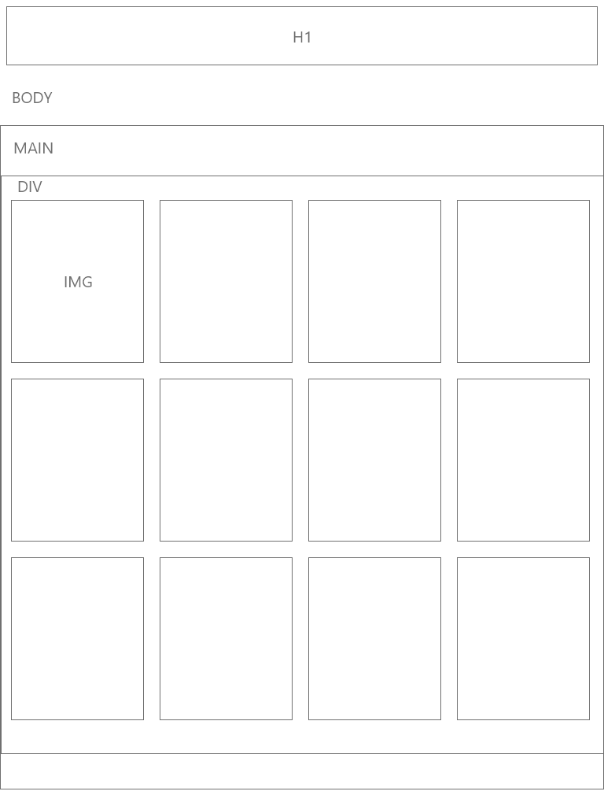
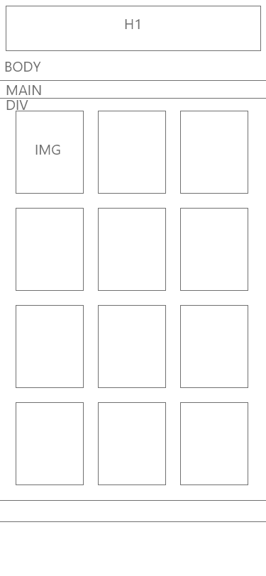
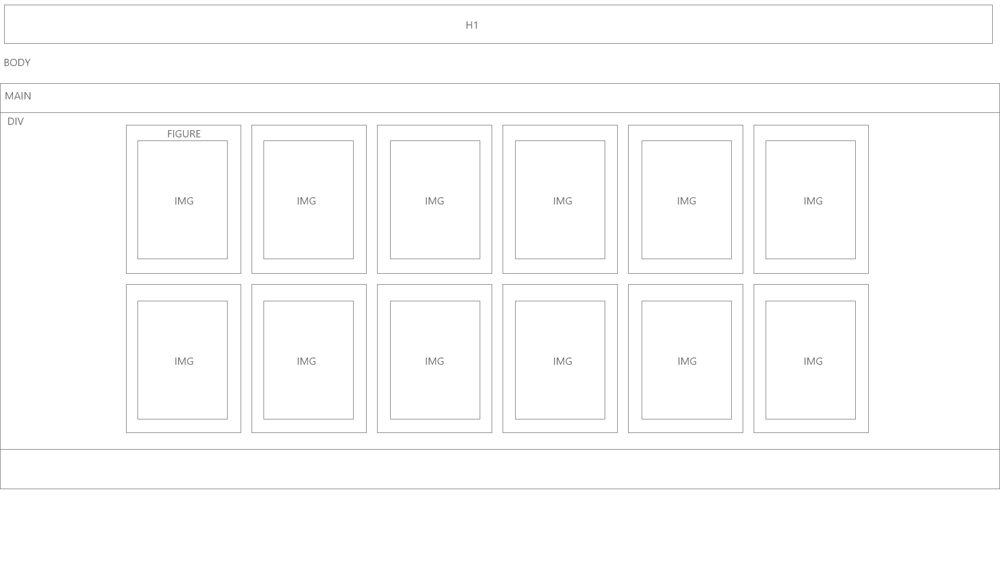

# Star Wars Memory Game

## Wiframe

WireFrame & User Tree

stats

blog

**Please note that this project is still in active development. Some options may not work yet!**

## Features

Currently Memory-Game is an evalution project.

### Functional Specifications:

Functional Specifications:

- Display 12 cards face down on the screen 
- When the player clicks on a card, it turns over 
- When the player clicks on a second card if it is identical to the previous one, the two cards remain face up otherwise the cards are hidden again.
- When all pairs are found and therefore all cards are face up the game is over

### Technical specifications :

- HTML5

- CSS3

- Framework Boostrap4

- Boilerplate base

- JavaScript with respect to ES6 standards

- You produced simple wireframe mockups for at least one of the pages

- You have produced a functional tree structure of the application showing the use cases possible from page

- Your wireframes are accessible in a DOC folder

- Your interface is responsive on all media

- You respect the DRY principle

- Your code is commented

- Your code is hosted on GitHub

- You have used versioning software

- Your site is hosted via a GH-page

- The repository contains a readme, description and tags

- You use a KANBAN-type project management tool. Ideally for each task you estimate time and priority and put yourself in the user's shoes.

- The rendering will be done via github. You will need to upload a file in your name to TEAMS before Sunday evening midnight.

